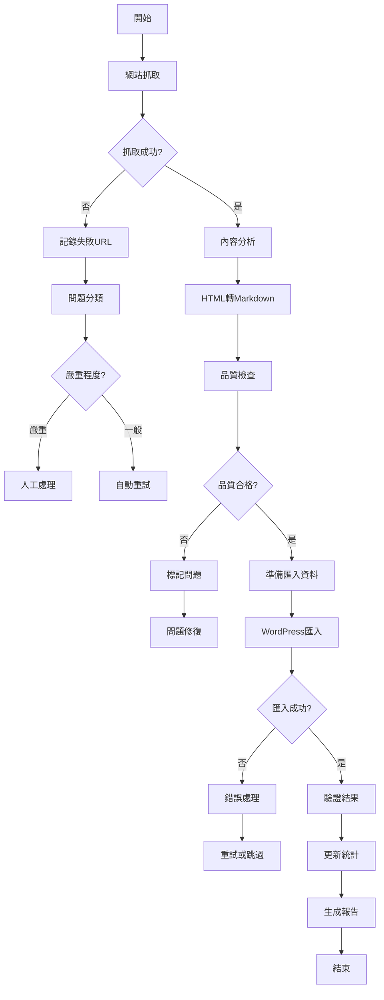

# 中台世界網站轉型完整流程文件
## 基於完整討論歷程的綜合整理

---

## 📋 **專案概述**

### **目標**
- 將 ctworld.org 從傳統網站轉型為 Headless CMS 架構
- 實現大量內容的自動化抓取、轉換、匯入流程
- 建立可維護、可擴展的內容管理系統

### **技術棧**
- **前端**: React + Vite + Tailwind CSS + TypeScript
- **後端**: Supabase (Database + Edge Functions)
- **目標CMS**: WordPress (Headless模式)
- **內容格式**: HTML → Markdown → WordPress

---

## 🔄 **完整工作流程**

### **階段 1: 網站內容抓取**

#### **1.1 抓取策略**
```
工具選擇: Firecrawl API (crawl_website_for_cloning)
抓取範圍: 20-50 頁面 (可調整)
輸出格式: JSON + HTML 檔案
儲存位置: /website_crawl/
```

#### **1.2 抓取結果處理**
- **成功抓取**: 儲存至 `crawl_results.json` 和 `/pages/` 目錄
- **失敗處理**: 記錄失敗URL和原因
- **品質檢查**: 驗證抓取內容完整性

#### **1.3 無效網址處理**
```javascript
// 無效網址分類和記錄
const urlValidation = {
  categories: {
    '404_NOT_FOUND': '頁面不存在',
    'TIMEOUT': '請求超時',
    'ACCESS_DENIED': '存取被拒',
    'MALFORMED_URL': '網址格式錯誤',
    'REDIRECT_LOOP': '重定向循環',
    'SERVER_ERROR': '伺服器錯誤'
  },
  
  logInvalidUrl: (url, category, error) => {
    const logEntry = {
      timestamp: new Date().toISOString(),
      url: url,
      category: category,
      error: error.message,
      statusCode: error.status || 'N/A'
    };
    
    // 寫入日誌檔案
    fs.appendFileSync('invalid_urls.log', JSON.stringify(logEntry) + '\n');
    
    // 更新統計
    updateCrawlStatistics(category);
  }
};
```

---

### **階段 2: 內容分析與分類**

#### **2.1 自動內容分類**
```javascript
// 基於URL和內容的自動分類
const contentClassifier = {
  classifyByUrl: (url) => {
    if (url.includes('/sutra_stories/')) return 'teaching';
    if (url.includes('/chan_master/')) return 'teaching';
    if (url.includes('/monthly/')) return 'magazine';
    if (url.includes('/realtime/')) return 'news';
    return 'unknown';
  },
  
  classifyByContent: (html) => {
    // 基於內容特徵的分類邏輯
    const indicators = {
      teaching: ['老和尚', '開示', '佛典', '禪師'],
      news: ['報導', '活動', '法會'],
      magazine: ['月刊', '專題', '本期']
    };
    
    for (const [type, keywords] of Object.entries(indicators)) {
      if (keywords.some(keyword => html.includes(keyword))) {
        return type;
      }
    }
    return 'unknown';
  }
};
```

#### **2.2 問題分類系統**
```javascript
// 內容問題自動分類
const issueClassifier = {
  CRITICAL: {
    description: '嚴重問題，需要人工處理',
    examples: ['完全無法解析', '內容為空', '編碼嚴重錯誤'],
    action: 'MANUAL_REVIEW'
  },
  
  MAJOR: {
    description: '主要問題，影響內容品質',
    examples: ['圖片連結失效', '格式混亂', '部分亂碼'],
    action: 'AUTO_FIX_WITH_LOG'
  },
  
  MINOR: {
    description: '次要問題，可自動修復',
    examples: ['多餘空白', '標籤不完整', '輕微格式問題'],
    action: 'AUTO_FIX'
  },
  
  WARNING: {
    description: '警告，需要注意但不影響處理',
    examples: ['內容較短', '缺少某些欄位', '格式不標準'],
    action: 'LOG_ONLY'
  }
};
```

---

### **階段 3: HTML 轉 Markdown 處理**

#### **3.1 轉換規則應用**
基於 `HTML_TO_MARKDOWN_CONVERSION_RULES_V2.md` 的完整規則：

```javascript
// 完整轉換流程
const htmlToMarkdownProcessor = {
  preProcess: (html) => {
    // 1. 移除雜訊區塊
    html = this.removeNoiseBlocks(html);
    // 2. 清理無效標籤
    html = this.cleanInvalidTags(html);
    // 3. 修復編碼問題
    html = this.fixEncoding(html);
    return html;
  },
  
  removeNoiseBlocks: (html) => {
    const noisePatterns = [
      /繁體中文.*?網站地圖/g,
      /回首頁|上一頁|下一頁/g,
      /版權所有：中台山佛教基金會/g,
      /轉載圖文請先徵求同意/g,
      /閱讀感言.*?心得:/gs,
      /友善列印|列印本頁|Print|下載|Download/g
    ];
    
    noisePatterns.forEach(pattern => {
      html = html.replace(pattern, '');
    });
    
    return html;
  },
  
  convertToMarkdown: (html) => {
    // 應用完整轉換規則
    let markdown = html;
    
    // 標題轉換
    markdown = this.convertHeadings(markdown);
    // 段落轉換
    markdown = this.convertParagraphs(markdown);
    // 特殊格式處理
    markdown = this.handleSpecialFormats(markdown);
    // 列表轉換
    markdown = this.convertLists(markdown);
    // 圖片處理
    markdown = this.handleImages(markdown);
    
    return markdown;
  }
};
```

#### **3.2 轉換品質檢查**
```javascript
const qualityChecker = {
  checkConversion: (original, converted) => {
    const issues = [];
    
    // 檢查內容長度差異
    if (converted.length < original.length * 0.5) {
      issues.push({
        type: 'CRITICAL',
        message: '轉換後內容過短，可能遺失重要內容'
      });
    }
    
    // 檢查標題結構
    const headings = converted.match(/^#+\s/gm);
    if (!headings || headings.length === 0) {
      issues.push({
        type: 'MAJOR',
        message: '缺少標題結構'
      });
    }
    
    // 檢查圖片連結
    const images = converted.match(/!\[.*?\]\(.*?\)/g);
    if (images) {
      images.forEach(img => {
        const url = img.match(/\((.*?)\)/)[1];
        if (!this.isValidImageUrl(url)) {
          issues.push({
            type: 'MAJOR',
            message: `無效圖片連結: ${url}`
          });
        }
      });
    }
    
    return issues;
  }
};
```

---

### **階段 4: WordPress 匯入處理**

#### **4.1 匯入策略選擇**
基於討論結果，採用 **WordPress Plugin 方案**：

```php
// WordPress Plugin 匯入流程
class CTWorld_Importer {
  
  public function import_batch($json_files, $options = []) {
    $results = [
      'success' => 0,
      'failed' => 0,
      'skipped' => 0,
      'errors' => []
    ];
    
    foreach ($json_files as $file) {
      try {
        $data = json_decode(file_get_contents($file), true);
        $post_id = $this->import_single_post($data, $options);
        
        if ($post_id) {
          $results['success']++;
          $this->log_success($file, $post_id);
        } else {
          $results['skipped']++;
          $this->log_skip($file, 'Already exists or invalid data');
        }
        
      } catch (Exception $e) {
        $results['failed']++;
        $results['errors'][] = [
          'file' => $file,
          'error' => $e->getMessage()
        ];
        $this->log_error($file, $e);
      }
    }
    
    return $results;
  }
  
  private function import_single_post($data, $options) {
    // 檢查是否已存在
    $existing = $this->find_existing_post($data['external_id']);
    
    if ($existing && !$options['force_update']) {
      return false; // 跳過已存在的文章
    }
    
    // 準備文章資料
    $post_data = $this->prepare_post_data($data);
    
    // 匯入文章
    $post_id = $existing ? 
      wp_update_post($post_data) : 
      wp_insert_post($post_data);
    
    if (is_wp_error($post_id)) {
      throw new Exception($post_id->get_error_message());
    }
    
    // 處理自訂欄位
    $this->handle_custom_fields($post_id, $data['meta']);
    
    // 處理分類和標籤
    $this->handle_taxonomies($post_id, $data);
    
    // 處理圖片
    $this->handle_images($post_id, $data);
    
    return $post_id;
  }
}
```

#### **4.2 錯誤處理機制**
```php
// 完整的錯誤處理和日誌系統
class CTWorld_Error_Handler {
  
  const ERROR_LEVELS = [
    'CRITICAL' => 1,
    'MAJOR' => 2,
    'MINOR' => 3,
    'WARNING' => 4
  ];
  
  public function handle_import_error($error, $context = []) {
    $error_level = $this->classify_error($error);
    
    switch ($error_level) {
      case 'CRITICAL':
        $this->handle_critical_error($error, $context);
        break;
      case 'MAJOR':
        $this->handle_major_error($error, $context);
        break;
      case 'MINOR':
        $this->handle_minor_error($error, $context);
        break;
      case 'WARNING':
        $this->handle_warning($error, $context);
        break;
    }
  }
  
  private function classify_error($error) {
    $message = $error->getMessage();
    
    // 嚴重錯誤
    if (strpos($message, 'database') !== false ||
        strpos($message, 'permission') !== false ||
        strpos($message, 'authentication') !== false) {
      return 'CRITICAL';
    }
    
    // 主要錯誤
    if (strpos($message, 'invalid') !== false ||
        strpos($message, 'missing') !== false ||
        strpos($message, 'format') !== false) {
      return 'MAJOR';
    }
    
    // 次要錯誤
    if (strpos($message, 'image') !== false ||
        strpos($message, 'media') !== false) {
      return 'MINOR';
    }
    
    return 'WARNING';
  }
  
  private function handle_critical_error($error, $context) {
    // 停止匯入流程
    $this->log_error('CRITICAL', $error, $context);
    $this->send_admin_notification($error, $context);
    throw $error; // 重新拋出錯誤
  }
  
  private function handle_major_error($error, $context) {
    // 記錄錯誤但繼續處理
    $this->log_error('MAJOR', $error, $context);
    $this->add_to_retry_queue($context);
  }
  
  private function handle_minor_error($error, $context) {
    // 嘗試自動修復
    $fixed = $this->attempt_auto_fix($error, $context);
    if (!$fixed) {
      $this->log_error('MINOR', $error, $context);
    }
  }
}
```

---

### **階段 5: 品質保證與驗證**

#### **5.1 自動化測試**
```javascript
// 完整的測試套件
const testSuite = {
  
  // 抓取測試
  testCrawling: async () => {
    const testUrls = [
      'https://www.ctworld.org.tw/sutra_stories/story148.htm',
      'https://www.ctworld.org.tw/chan_master/east009.htm'
    ];
    
    for (const url of testUrls) {
      const result = await crawlSinglePage(url);
      assert(result.success, `Failed to crawl ${url}`);
      assert(result.content.length > 100, `Content too short for ${url}`);
    }
  },
  
  // 轉換測試
  testConversion: () => {
    const testCases = [
      {
        html: '<h1>測試標題</h1><p>測試內容</p>',
        expected: '# 測試標題\n\n測試內容\n\n'
      },
      {
        html: '<span class="blue">重要提示</span>',
        expected: '### 重要提示'
      }
    ];
    
    testCases.forEach(testCase => {
      const result = htmlToMarkdown(testCase.html);
      assert(result.includes(testCase.expected), 
        `Conversion failed for: ${testCase.html}`);
    });
  },
  
  // 匯入測試
  testImport: async () => {
    const testData = {
      post_title: '測試文章',
      post_content: '測試內容',
      external_id: 'test_001'
    };
    
    const result = await importToWordPress(testData);
    assert(result.success, 'Import failed');
    assert(result.post_id > 0, 'Invalid post ID');
  }
};
```

#### **5.2 品質檢查清單**
```markdown
## 匯入前檢查
- [ ] 所有必要欄位都已填寫
- [ ] 圖片連結有效且可存取
- [ ] 內容格式正確（Markdown語法）
- [ ] 分類和標籤已正確設定
- [ ] 沒有重複的 external_id

## 匯入後驗證
- [ ] 文章在 WordPress 後台正確顯示
- [ ] 前台渲染效果正常
- [ ] 圖片正確載入
- [ ] 連結可正常點擊
- [ ] SEO 資訊完整

## 批次處理檢查
- [ ] 匯入統計正確（成功/失敗數量）
- [ ] 錯誤日誌完整記錄
- [ ] 沒有遺漏的內容
- [ ] 效能表現在可接受範圍
```

---

### **階段 6: 監控與維護**

#### **6.1 即時監控系統**
```javascript
// 匯入進度監控
const importMonitor = {
  
  startMonitoring: (batchId) => {
    this.batchId = batchId;
    this.startTime = Date.now();
    this.stats = {
      total: 0,
      processed: 0,
      success: 0,
      failed: 0,
      errors: []
    };
  },
  
  updateProgress: (status, item) => {
    this.stats.processed++;
    this.stats[status]++;
    
    if (status === 'failed') {
      this.stats.errors.push({
        item: item,
        timestamp: new Date().toISOString(),
        error: item.error
      });
    }
    
    // 即時更新進度
    this.broadcastProgress();
  },
  
  broadcastProgress: () => {
    const progress = {
      batchId: this.batchId,
      progress: (this.stats.processed / this.stats.total) * 100,
      stats: this.stats,
      estimatedTimeRemaining: this.calculateETA()
    };
    
    // 發送到前端或日誌系統
    this.sendProgressUpdate(progress);
  }
};
```

#### **6.2 日誌系統**
```javascript
// 完整的日誌記錄系統
const logger = {
  
  levels: {
    ERROR: 0,
    WARN: 1,
    INFO: 2,
    DEBUG: 3
  },
  
  log: (level, message, context = {}) => {
    const logEntry = {
      timestamp: new Date().toISOString(),
      level: level,
      message: message,
      context: context,
      batchId: this.currentBatchId,
      sessionId: this.sessionId
    };
    
    // 寫入不同的日誌檔案
    this.writeToFile(level, logEntry);
    
    // 如果是錯誤，同時寫入錯誤日誌
    if (level === 'ERROR') {
      this.writeToErrorLog(logEntry);
    }
  },
  
  // 專門的網址問題日誌
  logUrlIssue: (url, issue, category) => {
    const urlLogEntry = {
      timestamp: new Date().toISOString(),
      url: url,
      issue: issue,
      category: category,
      batchId: this.currentBatchId
    };
    
    this.writeToFile('URL_ISSUES', urlLogEntry);
    
    // 更新統計
    this.updateUrlStatistics(category);
  },
  
  // 生成問題分類報告
  generateIssueReport: () => {
    const report = {
      summary: this.getIssueSummary(),
      criticalIssues: this.getCriticalIssues(),
      urlIssues: this.getUrlIssues(),
      recommendations: this.generateRecommendations()
    };
    
    this.writeToFile('REPORT', report);
    return report;
  }
};
```

---

## 📊 **完整流程圖**



---

## 🔧 **工具和腳本**

### **1. 批次處理腳本**
```bash
#!/bin/bash
# batch_import.sh - 完整的批次匯入腳本

BATCH_SIZE=50
DELAY=5
LOG_DIR="./logs"
DATA_DIR="./data"

# 創建日誌目錄
mkdir -p $LOG_DIR

# 開始批次處理
echo "開始批次匯入 - $(date)" | tee -a $LOG_DIR/batch.log

# 處理每個批次
for batch in $(ls $DATA_DIR/batch_*.json); do
    echo "處理批次: $batch" | tee -a $LOG_DIR/batch.log
    
    # 執行匯入
    wp ctworld-import run \
        --file=$batch \
        --limit=$BATCH_SIZE \
        --dry-run=false \
        --log-file=$LOG_DIR/import_$(basename $batch).log
    
    # 檢查結果
    if [ $? -eq 0 ]; then
        echo "批次 $batch 匯入成功" | tee -a $LOG_DIR/batch.log
    else
        echo "批次 $batch 匯入失敗" | tee -a $LOG_DIR/batch.log
    fi
    
    # 延遲避免過載
    sleep $DELAY
done

echo "批次匯入完成 - $(date)" | tee -a $LOG_DIR/batch.log
```

### **2. 監控腳本**
```bash
#!/bin/bash
# monitor.sh - 匯入進度監控

LOG_FILE="./logs/batch.log"
STATS_FILE="./logs/stats.json"

while true; do
    # 統計匯入進度
    TOTAL=$(grep -c "處理批次" $LOG_FILE)
    SUCCESS=$(grep -c "匯入成功" $LOG_FILE)
    FAILED=$(grep -c "匯入失敗" $LOG_FILE)
    
    # 生成統計JSON
    cat > $STATS_FILE << EOF
{
    "timestamp": "$(date -Iseconds)",
    "total": $TOTAL,
    "success": $SUCCESS,
    "failed": $FAILED,
    "progress": $(echo "scale=2; $SUCCESS * 100 / $TOTAL" | bc -l)
}
EOF
    
    # 顯示進度
    echo "進度: $SUCCESS/$TOTAL ($(echo "scale=1; $SUCCESS * 100 / $TOTAL" | bc -l)%)"
    
    sleep 30
done
```

---

## 📋 **檢查清單**

### **專案啟動前**
- [ ] Supabase 專案已連接並測試
- [ ] WordPress 網站已設置並可存取
- [ ] 所有必要的 API 金鑰已設定
- [ ] 測試環境已準備完成
- [ ] 備份策略已制定

### **抓取階段**
- [ ] 目標網址清單已準備
- [ ] 抓取參數已設定（頁面數量、深度等）
- [ ] 儲存空間充足
- [ ] 網路連線穩定
- [ ] 錯誤處理機制已啟用

### **轉換階段**
- [ ] HTML轉Markdown規則已更新
- [ ] 測試案例已通過
- [ ] 品質檢查機制已啟用
- [ ] 問題分類系統已設定
- [ ] 自動修復功能已測試

### **匯入階段**
- [ ] WordPress Plugin 已安裝並啟用
- [ ] 資料庫連線已測試
- [ ] 批次大小已最佳化
- [ ] 重試機制已設定
- [ ] 監控系統已啟動

### **完成後驗證**
- [ ] 匯入統計正確
- [ ] 內容顯示正常
- [ ] 圖片載入正常
- [ ] 連結功能正常
- [ ] SEO 設定完整
- [ ] 效能表現良好

---

## 🚨 **風險管理**

### **技術風險**
1. **API 限制**: 設定適當的請求間隔和重試機制
2. **記憶體不足**: 使用批次處理和資源監控
3. **網路不穩**: 實作斷點續傳和自動重試
4. **資料損失**: 定期備份和版本控制

### **內容風險**
1. **格式錯誤**: 多層品質檢查和人工驗證
2. **內容遺失**: 完整的日誌記錄和比對機制
3. **編碼問題**: UTF-8 強制轉換和亂碼修復
4. **版權問題**: 來源標記和授權檢查

### **營運風險**
1. **時程延誤**: 分階段執行和里程碑檢查
2. **資源不足**: 雲端擴展和負載平衡
3. **人力短缺**: 自動化工具和外部協作
4. **品質問題**: 多重驗證和用戶測試

---

## 📈 **成功指標**

### **量化指標**
- 抓取成功率 > 95%
- 轉換品質分數 > 90%
- 匯入成功率 > 98%
- 處理速度 > 100 頁/小時
- 錯誤率 < 2%

### **質化指標**
- 內容完整性保持
- 格式一致性良好
- 用戶體驗提升
- 維護效率改善
- 擴展性增強

---

## 📞 **支援與協作**

### **AI 協作策略**
基於討論，建議的 AI 協作方案：

1. **Claude 3.5 Sonnet**: 負責複雜邏輯和規劃
2. **Cursor IDE**: 負責程式碼實作和除錯
3. **Skywork**: 負責整合和專案管理
4. **ChatGPT**: 負責特定問題解決和優化

### **人工介入點**
- 嚴重錯誤處理
- 品質最終驗證
- 策略決策調整
- 用戶需求確認

---

**這份文件涵蓋了我們討論過的所有重要流程和細節，可作為完整的專案執行指南！** 🚀

---

## 7. 多媒體、索引頁與多語策略（整合版）

本章節補充三個在實作中非常重要的決策：

1. 圖片與圖說（caption）的結構化設計  
2. 索引頁 `ct_index_page` 的角色  
3. zh-TW / zh-CN / en / ja 多語與 `-gb` 網頁的處理策略

---

### 7.1 圖片與圖說（caption）策略

#### 7.1.1 主線原則（方案 B）

- **Source of truth 在 JSON，而不是 Markdown**
- 圖說 **只存到 JSON 欄位**，不再寫進 `body_markdown`，避免前端出現重複文字

#### 7.1.2 JSON 結構設計

所有內容類型（teaching, news, magazine, branch…）共用以下欄位：

```jsonc
{
  "featured_image": "https://.../main.jpg",
  "featured_image_caption": "禪七齋堂共修情景。",
  "gallery_items": [
    {
      "url": "https://.../image2.jpg",
      "alt": "供佛儀軌",
      "caption": "供佛儀軌時，僧眾靜默安住。"
    },
    {
      "url": "https://.../image3.jpg",
      "alt": "信眾禮佛",
      "caption": null
    }
  ]
}
```

規則：

- 若頁面有圖片：
  - 第一張 → `featured_image`
  - 其餘 → `gallery_items[]`
- 若圖片旁緊接一小段說明文字（典型圖說）：
  - 不放進 `body_markdown`
  - 只映射到：
    - `featured_image_caption` 或 `gallery_items[].caption`
- 若頁面結構極簡（「只有一段主文 + 圖片」）：
  - 一樣：
    - 第一張 → `featured_image`
    - 其餘 → `gallery_items[]`（通常是空）

前端可以根據設計決定：

- 是否顯示 caption
- 出現在圖片下方、hover 或 modal 中  
- gallery 樣式可以切換（單一欄位 `ct_gallery_style` 控制）

---

### 7.2 教學內容（Teaching）中的中英偈語策略

某些頁面包含「活動報導 + 中英偈語／起七法語」：

- 報導正文 → 放在 `body_markdown`
- **偈語區塊 → 獨立欄位**，方便排版單獨呈現或彙整

推薦欄位：

```jsonc
{
  "post_type": "teaching",
  "body_markdown": "（活動報導正文）",
  "meta": {
    "ct_has_dharma_verse": "yes",
    "ct_verse_type": "起七法語",      // 或 解七法語、法會偈語…
    "ct_verse_block_markdown": "> 金蛇巧步綻春暉…\n> The golden Snake steps gracefully…",
    "ct_verse_lang": "bilingual"      // zh-TW, en, bilingual…
  }
}
```

HTML→Markdown 工具負責：

- 辨識「偈語段落」與一般段落
- 正文 → `body_markdown`
- 偈語 → `ct_verse_block_markdown`（內部用 quote 或簡單 Markdown）

前端可以：

- 在教學頁的正文下方渲染一個「法語區塊」
- 或從所有含有 `ct_has_dharma_verse = yes` 的文章，做「禪七法語專區」

---

### 7.3 索引頁 `ct_index_page` 的定位

舊站有許多「目錄 / 年表 / 索引頁」：

- 佛典故事目錄
- 禪門公案目錄
- 中台事記年表
- …等

新系統策略：

- **不再把索引頁當「內容給訪客看」**，而是：
  - 當作「索引設定 + debug 資訊」
  - 改由新系統動態產生真正的 index 列表

#### 7.3.1 自訂 Post Type: `ct_index_page`

在 WordPress 插件中註冊一個新的 CPT：

- `post_type = ct_index_page`
- `public = false`（不對前台公開）
- `show_ui = true`（在後台有 UI）
- 可以掛在「中台內容」選單下，例如：`show_in_menu = 'ctworld_content'`

資料範例：

```jsonc
{
  "post_type": "index_page",
  "old_url": "https://www.ctworld.org/sutra_stories/index.htm",
  "body_markdown": "# [DEBUG] sutra_stories index page\n\n此頁為舊站索引頁，不作為前端正式內容。\n",
  "meta": {
    "ct_index_key": "sutra_stories",
    "ct_index_notes": "舊站索引頁，僅供爬蟲與除錯使用。"
  }
}
```

用途：

- 後台可見，方便找到舊索引頁的設定與說明
- 前台實際的「佛典故事目錄」會用 React / API 根據 `ct_index_key` 動態產生

---

### 7.4 多語設計與 Polylang 對齊策略

支援語言：

- `zh-TW`、`zh-CN`、`en`、`ja`

在 JSON 層：

- 每一筆實際內容是一個獨立 JSON：  
  例如同一篇 Teaching 可能有 4 個 JSON（4 個語言版本）
- 使用 `external_id` + `multilingual.translations` 做「翻譯群組」對齊

範例：

```jsonc
{
  "external_id": "teaching_20030315_heart_sutra_001",
  "language": "zh-TW",
  "post_type": "teaching",
  "post_title": "無畏自在──從《心經》看放下執著",
  "multilingual": {
    "translations": [
      {
        "language": "zh-CN",
        "external_id": "teaching_20030315_heart_sutra_001_zh-CN"
      },
      {
        "language": "en",
        "external_id": "teaching_20030315_heart_sutra_001_en"
      },
      {
        "language": "ja",
        "external_id": "teaching_20030315_heart_sutra_001_ja"
      }
    ]
  }
}
```

匯入 WordPress 時：

1. 匯入 zh-TW 版本 → 建立 `post_id_tw`，設語言 `zh-TW`
2. 匯入 zh-CN / en / ja → 建 `post_id_cn` / `post_id_en` / `post_id_ja`
3. 使用 Polylang API：  

```php
pll_set_post_language($post_id_tw, 'zh-TW');
pll_set_post_language($post_id_cn, 'zh-CN');
pll_set_post_language($post_id_en, 'en');
pll_set_post_language($post_id_ja, 'ja');

pll_save_post_translations([
    'zh-TW' => $post_id_tw,
    'zh-CN' => $post_id_cn,
    'en'    => $post_id_en,
    'ja'    => $post_id_ja,
]);
```

#### 7.4.1 Menu / 列表 / 單篇切換的行為

- **Menu**
  - 每種語言可以有自己的 menu 結構（繁中完整、英日精簡）
  - Polylang 可為每語言指定不同 menu

- **列表頁**
  - 某語言的列表頁只顯示該語言的文章（沒有日文版就等於不存在）

- **單篇語言切換**
  - 語言切換器只顯示「實際有翻譯版本」的語言  
  - 沒有某語言版本 → 該語言按鈕不顯示

---

### 7.5 `-gb` 網頁與 zh-TW → zh-CN 自動化 pipeline

舊站有一批 `-gb`（簡體版）網頁，內容與繁中的主頁相同，只是字形不同。

策略：

1. **爬蟲階段**
   - 掃 sitemap / menu 時，對 URL 做分組：
     - `xxx.htm` → 視為 `zh-TW` base URL
     - `xxx-gb.htm` → 視為簡體對應 URL
   - 建立 `baseUrl ↔ gbUrl` 配對表：

     ```jsonc
     {
       "baseUrl": "https://www.ctworld.org/sutra_stories/story148.htm",
       "gbUrl": "https://www.ctworld.org/sutra_stories/story148-gb.htm"
     }
     ```

   - 只抓取 `baseUrl` 的 HTML，`gbUrl` 不抓 HTML，只記錄在 mapping 中。

2. **HTML → Markdown → JSON（zh-TW）**
   - 對 `baseUrl` 做完整轉換，產生 zh-TW JSON
   - 若該篇有 `gbUrl`：

     ```jsonc
     "multilingual": {
       "translations": [
         {
           "language": "zh-CN",
           "old_url": "https://www.ctworld.org/sutra_stories/story148-gb.htm",
           "status": "planned"
         }
       ]
     }
     ```

3. **自動繁→簡：產生 zh-CN JSON**

   使用工具（例如 Node.js + `opencc`）：

   - 讀取 zh-TW JSON  
   - 對以下欄位做繁簡轉換：
     - `post_title`
     - `post_excerpt`
     - `body_markdown`
     - `meta` 中所有中文 string
     - `seo.meta_title` / `seo.meta_description`
   - 不轉換：URL、檔名、非中文代碼
   - 產生一份新的 zh-CN JSON：

     ```jsonc
     {
       "external_id": "teaching_20030315_heart_sutra_001_zh-CN",
       "language": "zh-CN",
       "old_url": "https://www.ctworld.org/sutra_stories/story148-gb.htm",
       "post_title": "無畏自在——從《心经》看放下执著",
       "post_excerpt": "……（簡體字版）",
       "body_markdown": "……（簡體字版）"
     }
     ```

   - 並將 `multilingual.translations` 中的 zh-CN 該筆標記為 `"status": "generated"`

4. **匯入 WordPress 與 redirect**

   - 第一輪匯入 zh-TW JSON → 設語言 `zh-TW`
   - 第二輪匯入 zh-CN JSON → 設語言 `zh-CN`，並透過 `external_id` / group id 對齊
   - 同時：
     - 將 `old_url`（含 `-gb`）存到 post meta，例如 `_ct_old_url_gb`
     - 匯入到 redirect 系統（外掛或自訂表），做 301 redirect
       - `story148-gb.htm` → 新站 zh-CN 對應 URL

如此可以達到：

- 不必重抓一份簡體 HTML
- zh-CN 內容與 zh-TW 完全等價（只差字形）
- 保留所有舊簡體網址的 SEO 與連結
